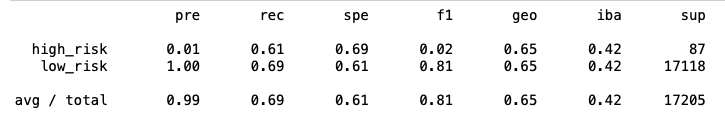
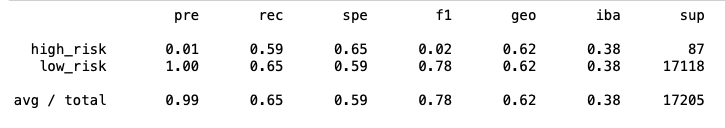
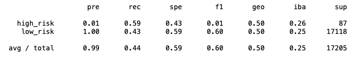
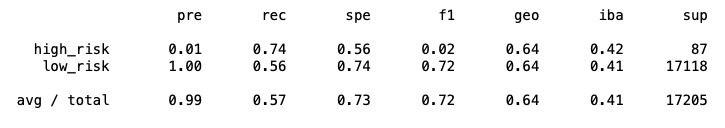
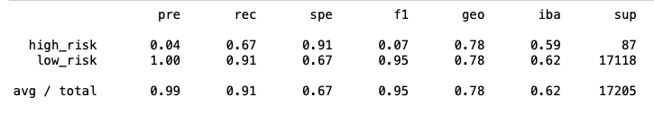
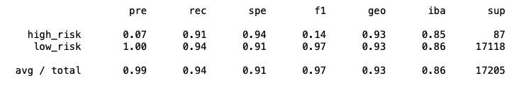

# Credit_Risk_Analysis## Overview
Credit risk is an inherently unbalanced classification problem, as good loans easily outnumber risky loans. In this analysis, I employed different techniques to train and evaluate models with unbalanced classes using imbalanced-learn and scikit-learn libraries to build and evaluate models using resampling. 

## Results
- Random Oversampling
  - Accuracy: 0.65
  - Precision: 0.99
    - High risk: 0.01 
    - Low risk: 1.00
  - Recall (Sensitivity): 0.69
    - High risk: 0.61
    - Low risk: 0.69

|*Random Oversampling Imbalanced Classification Report*|
|:--:|
||

- SMOTE Oversampling
  - Accuracy: 0.62
  - Precision: 0.99
    - High risk: 0.01 
    - Low risk: 1.00
  - Recall (Sensitivity): 0.65
    - High risk: 0.59
    - Low risk: 0.65

|*SMOTE Oversampling Imbalanced Classification Report*|
|:--:|
||

- Cluster Centroids Undersampling
  - Accuracy: 0.51
  - Precision: 0.99
    - High risk: 0.01 
    - Low risk: 1.00
  - Recall (Sensitivity): 0.44
    - High risk: 0.59
    - Low risk: 0.43
  
|*Cluster Centroids Undersampling Imbalanced Classification Report*|
|:--:|
||

- SMOTEENN Combination Sampling
  - Accuracy: 0.65
  - Precision: 0.99
    - High risk: 0.01 
    - Low risk: 1.00
  - Recall (Sensitivity): 0.57
    - High risk: 0.74
    - Low risk: 0.56

|*SMOTEENN Combination Sampling Imbalanced Classification Report*|
|:--:|
||

- Balanced Random Forest Classifier
  - Accuracy: 0.79
  - Precision: 0.99
    - High risk: 0.04 
    - Low risk: 1.00
  - Recall (Sensitivity): 0.91
    - High risk: 0.67
    - Low risk: 0.91

|*Balanced Random Forest Classifier Imbalanced Classification Report*|
|:--:|
||

- Easy Ensemble AdaBoost Classifier
  - Accuracy: 0.93
  - Precision: 0.99
    - High risk: 0.07 
    - Low risk: 1.00
  - Recall (Sensitivity): 0.94
    - High risk: 0.91
    - Low risk: 0.94

|*Easy Ensemble AdaBoost Classifier Imbalanced Classification Report*|
|:--:|
||

## Summary
Across all of the models used, the precision was high for low risk, but for high risk, it was nearly non-existent. For that reason, I would not recommend using any of the models. If one did need to be selected of any, I would recommend the Easy Ensemble AdaBoost Classifier because it had the highest accuracy of 0.93 and the highest precision for high risk at 0.07. It also had a high recall of 0.94. 